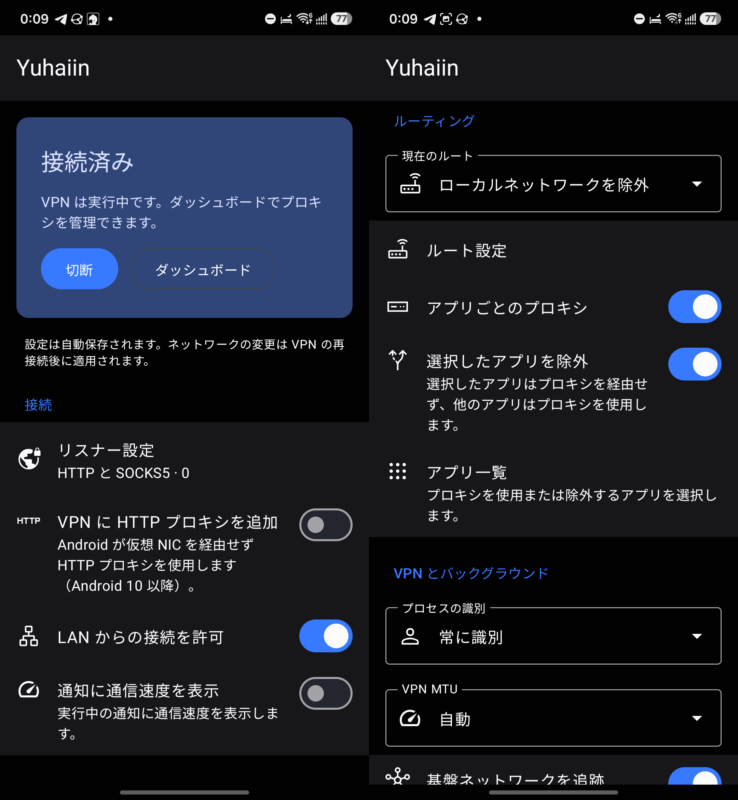

#

[](https://github.com/Asutorufa/yuhaiin-android/blob/master/LICENSE)
[](https://github.com/Asutorufa/yuhaiin-android/releases)


## yuhaiin-android

Android Client for [yuhaiin](https://github.com/Asutorufa/yuhaiin).

## Support Version

Android 5.0+ (API level 21)

## Download

[Release](https://github.com/Asutorufa/yuhaiin-android/releases)

## Build

Use JDK 25 (the version used by CI), Android SDK Platform 37 and Build Tools 36.1.0. Set `JAVA_HOME` to your JDK and `ANDROID_HOME` to your Android SDK, or configure the SDK with `sdk.dir` in `local.properties`. The commands below use Bash, Git and the GitHub CLI (`gh`).

```bash
git clone https://github.com/Asutorufa/yuhaiin-android.git
cd yuhaiin-android
```

Download the latest available native AAR from a successful upstream `go.yml` build on `main`, using an authenticated GitHub CLI (`gh auth login`). The shared resolver selects published AAR artifacts and verifies their individual workflow runs, avoiding stale results from GitHub's workflow-run listing API. CI uses the same resolver:

```bash
set -e
core_source=$(bash scripts/resolve-latest-core.sh)
core_run=$(printf '%s\n' "$core_source" | sed -n 's/^CORE_RUN_ID=//p')
gh run download "$core_run" --repo yuhaiin/yuhaiin --name yuhaiin.aar --dir yuhaiin
```

Android CI downloads the selected artifact by ID and records its upstream commit, workflow run, artifact ID and AAR checksum in `build-provenance.txt`. See [Android verification](scripts/README.md) for more details.

Run lint and unit tests, then build the release APKs:

```bash
./gradlew :app:lintDebug :app:testDebugUnitTest
./gradlew :app:assembleRelease --stacktrace
```

APKs are written to `app/build/outputs/apk/release/` for `arm64-v8a` and `x86_64`. Without signing configuration, their names end in `-release-unsigned.apk`. For an installable debug build, run `./gradlew :app:assembleDebug`; APKs are written to `app/build/outputs/apk/debug/`.

To sign a release with your own keystore, export all four signing variables before running the release build. Use an absolute keystore path:

```bash
export KEYSTORE_PATH=/absolute/path/to/release.keystore
export KEY_ALIAS=your_key_alias
read -r -s -p 'Keystore password: ' KEYSTORE_PASSWORD
printf '\n'
read -r -s -p 'Key password: ' KEY_PASSWORD
printf '\n'
export KEYSTORE_PASSWORD KEY_PASSWORD
./gradlew :app:assembleRelease --stacktrace
```

Signed APK names end in `-release.apk`. Release alignment checks, device regressions and baseline profile instructions are documented in [Android verification](scripts/README.md).

## Screenshot



## Acknowledgement

- [bndeff/socksdroid](https://github.com/bndeff/socksdroid)
- [Navigation Componentのいい感じのアニメーションを検討する【サンプルアプリあり】](https://at-sushi.work/blog/21/)  

## Android connection controls

- Add the **yuhaiin** tile in Quick Settings to connect/disconnect and see the current state. First connection opens Android VPN consent when needed.
- The running notification offers **Disconnect**, **Reconnect** and **Dashboard**. The native home card shows connection duration, core upload/download rates, physical network type, TUN MTU and addresses, and the active Route.
- **Metered mode** supports Auto / Metered / Unmetered after reconnecting. Metered explicitly marks the VPN as metered. Android's public VPN API inherits underlying network meteredness for both Auto and Unmetered; it cannot force a cellular connection to become unmetered.
- **Pause connection** offers 5 / 15 / 30 minutes. The TUN and core stop while a foreground notification keeps the resume timer available; use **Resume now** or **Cancel auto-resume** there or on the home card. Resume may be delayed during device sleep. Always-on VPN lockdown can block network access while paused. Force-stop and reboot interrupt the pause timer.
- Long-press the launcher icon for Connect / Disconnect / Switch Route, or add the home-screen status widget. Switching Route while connected saves the selection and reconnects automatically. These use the existing Android Route configurations; the app has no separate native Profile model.

Notification speed display remains optional. The native home page and widget receive the existing core speed callback independently of that display preference; no new core API or Web Dashboard polling is required.

## Backup, exit health and session summary

Open **Backup and restore** on the native home page to export a JSON backup through Android's file picker, import an existing file, or open the system Share Sheet. A single file includes core settings, nodes and selections, subscriptions, DNS, routing rules/lists and Android preferences, including custom Routes and per-app selections. Backups contain node passwords and subscription credentials. Runtime traffic/history, caches, installer state, document IDs and session summaries are excluded. Imports show a preview, ask before replacing configuration, disconnect the VPN and restore in one SQLite transaction. Reconnect afterwards to apply the restored configuration. Invalid, incomplete, incompatible or oversized files (over 32 MiB) are rejected; a failed restore rolls back the entire change.

The home connection card shows selected TCP/UDP node names, reachability and latency without opening the Dashboard. TCP uses the core HTTP probe and UDP uses its DNS probe. Checks run on connection, node/network changes, every minute, or with **Check now**. The check time is shown; these default-node checks do not certify every tagged route or destination. A missing default node is shown explicitly.

Traffic summaries show upload/download for this VPN session, active/opened/failed connection counts and persisted lifetime totals. Disconnecting preserves the last session summary on the device. These values measure traffic accounted by the Go core, including proxy traffic outside Android TUN routes, rather than Android system-wide data usage.

These features require the matching Go core changes in `cmd/android` and `pkg/storage/sqlite`. For a local build with the adjacent `yuhaiin` checkout, run `bash yuhaiin/build.sh` before Gradle so the AAR contains the new backup/status JNI methods. Upstream Android CI needs an AAR built from that core revision.
